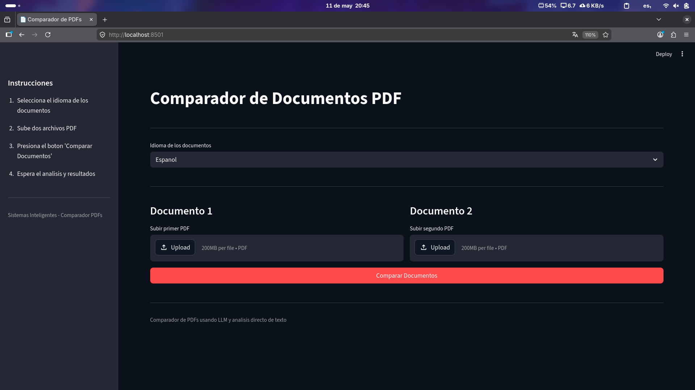
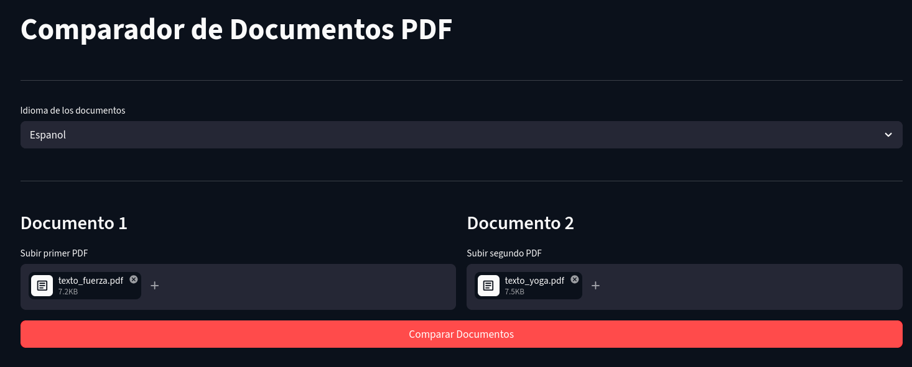
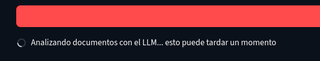
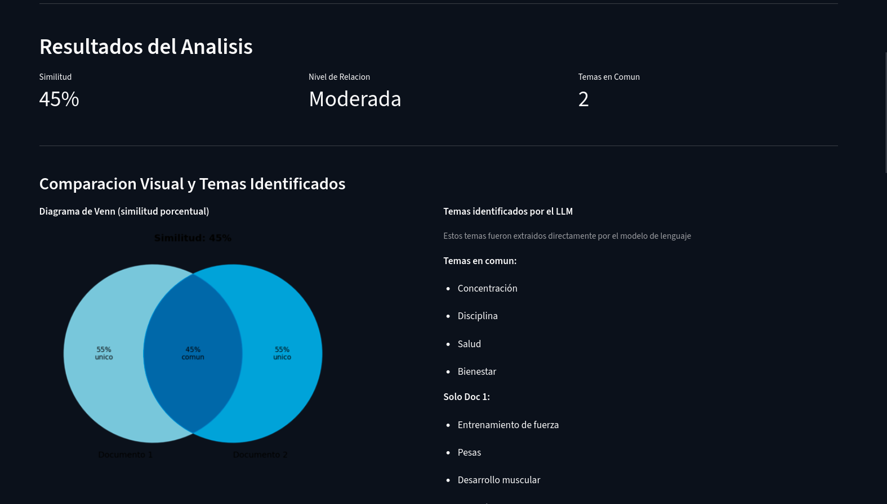
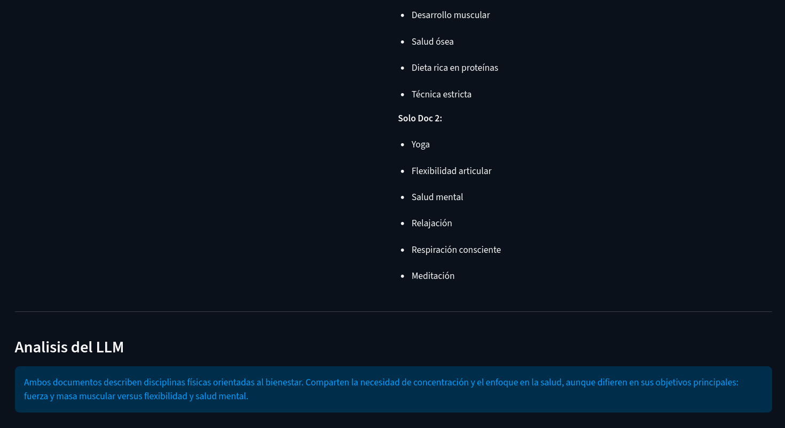
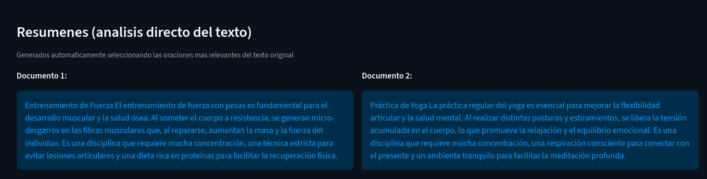
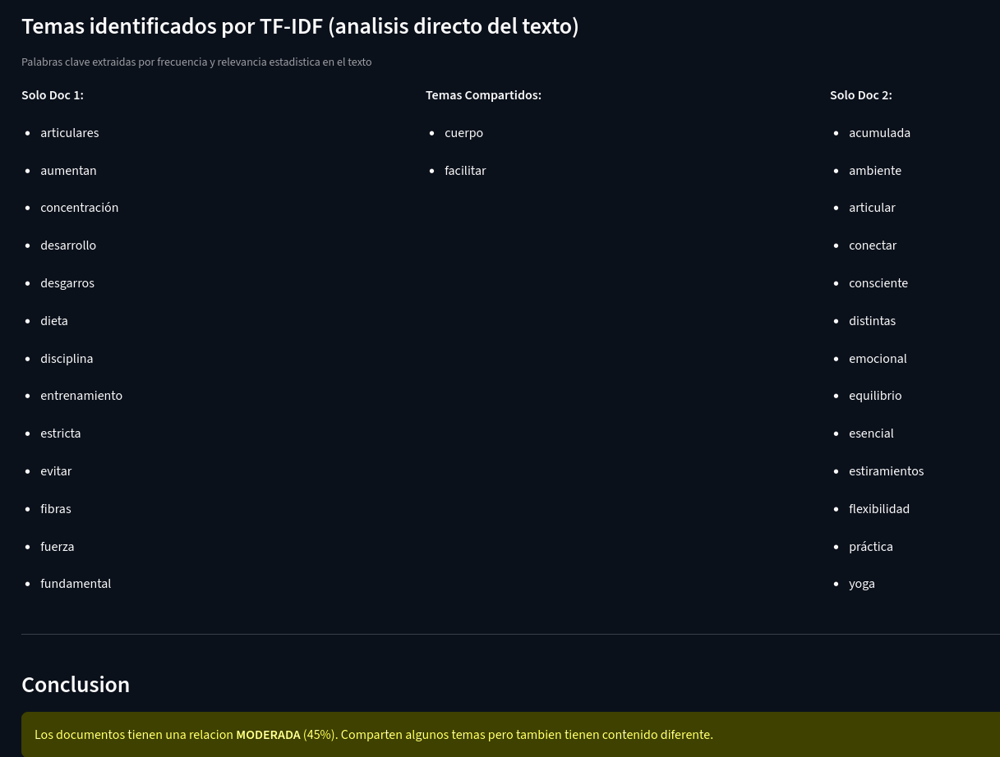

# Comparador de Documentos PDF

## Acerca del proyecto

Herramienta que permite comparar dos documentos PDF utilizando un LLM y análisis estadístico de texto (TF-IDF) para determinar su porcentaje de similitud, identificar temas en común y únicos, y generar un diagrama de Venn visual. Combina inteligencia artificial con técnicas clásicas de procesamiento de lenguaje natural para ofrecer resultados más completos. La interfaz está construida con **Streamlit**, lo que permite una interacción rápida y sencilla desde el navegador.

### Decisiones estructurales

El proyecto sigue un enfoque modular para mantener el código organizado y fácil de mantener:

- **`pdf_extractor.py`**: Encapsula la lógica de extracción de texto de PDFs, separando esta responsabilidad del resto del flujo.
- **`llm_analyzer.py`**: Combina comunicación con el LLM (API compatible con OpenAI) y análisis estadístico de texto con TF-IDF para extracción de temas y resumenes extractivos. Esto permite tener resultados tanto semánticos como estadísticos sin depender exclusivamente del modelo.
- **`venn_diagram.py`**: Generación independiente del diagrama de Venn, reutilizable en otros contextos.
- **`app.py`**: Punto de entrada de la aplicación Streamlit, orquestando los módulos anteriores sin contener lógica de negocio.
- **Dockerizado**: Se incluye `Dockerfile` y `docker-compose.yml` para facilitar el despliegue sin dependencias locales.

---

Herramienta para comparar dos documentos PDF y encontrar su porcentaje de similitud usando un LLM y analisis estadistico de texto (TF-IDF). Analiza si los documentos estan relacionados, extrae temas en comun y muestra un diagrama de Venn.

## Instalacion con Docker (recomendado)

### 1. Configurar API key

Edita el archivo `.env` y configura tu proveedor compatible con OpenAI:

```
LLM_API_KEY=tu-api-key-aqui
LLM_BASE_URL=https://tu-endpoint.com/v1
LLM_MODEL=qwen-3.5
```

### 2. Ejecutar con docker-compose

```bash
docker compose up --build
```

Se abrira en `http://localhost:8501`

## Instalacion local (sin Docker)

### 1. Configurar API key

Edita el archivo `.env` y configura tu proveedor compatible con OpenAI:

```
LLM_API_KEY=tu-api-key-aqui
LLM_BASE_URL=https://tu-endpoint.com/v1
LLM_MODEL=qwen-3.5
```

### 2. Instalar dependencias

```bash
pip install -r requirements.txt
```

### 3. Ejecutar

```bash
python -m streamlit run app.py
```

Se abrira en `http://localhost:8501`

## Como funciona

1. Selecciona el idioma de los documentos (Espanol o Ingles)
2. Sube dos archivos PDF
3. Presiona "Comparar Documentos"
4. La app muestra primero los resultados del **LLM**:
   - Porcentaje de similitud y nivel de relacion
   - Diagrama de Venn visual
   - Temas en comun y unicos identificados por el modelo
   - Explicacion semantica de la relacion entre documentos
5. Mas abajo se presentan los resultados del **analisis estadistico (TF-IDF)** para comparar:
   - Resumenes extractivos de cada documento
   - Palabras clave extraidas por relevancia estadistica (temas compartidos y unicos)

## Estructura del proyecto

| Archivo | Descripcion |
|---|---|
| `app.py` | Aplicacion principal de Streamlit |
| `pdf_extractor.py` | Extraccion de texto de PDFs |
| `llm_analyzer.py` | Analisis con LLM + analisis estadistico TF-IDF (resumenes extractivos, extraccion de temas) |
| `venn_diagram.py` | Generacion del diagrama de Venn |
| `.env` | Configuracion de API key (no subir a git) |
| `Dockerfile` | Configuracion del contenedor Docker |
| `docker-compose.yml` | Ejecucion con docker compose |
| `requirements.txt` | Dependencias del proyecto |
| `ejemplo.py` | Ejemplo de clase con question-answering |

## Modelos soportados

Cualquier modelo de un proveedor compatible con la API de OpenAI:
- **Qwen 3.5**, **Llama 3.1**, **Mistral**, **GPT-4o**, etc.
- Configurable en `.env` con `LLM_MODEL` y `LLM_BASE_URL`

## Nota

Los PDFs deben tener texto extraible (no pueden ser imagenes escaneadas).

---

## Evidencia de Funcionamiento

### Flujo completo de la aplicación

#### 1. Vista inicial



La aplicación se presenta en el navegador en `http://localhost:8501`. En el sidebar izquierdo se muestran las instrucciones de uso. El área principal contiene:

- **Selector de idioma**: Permite elegir entre Español e Inglés para el procesamiento de stopwords y el prompt al LLM.
- **Dos zonas de carga**: Columnas lado a lado para subir Documento 1 y Documento 2.
- **Botón "Comparar Documentos"**: Inicia el proceso de análisis.

---

#### 2. Archivos cargados



Se cargan dos PDFs de ejemplo: `texto_fuerza.pdf` (sobre entrenamiento de fuerza) y `texto_yoga.pdf` (sobre práctica de yoga). Los archivos se muestran con su nombre y tamaño antes de iniciar el análisis.

---

#### 3. Proceso de análisis



Al presionar el botón, se muestra un spinner con el mensaje *"Analizando documentos con el LLM... esto puede tardar un momento"*. Durante este proceso la aplicación:

1. Extrae el texto de ambos PDFs con `pdfplumber`
2. Genera resúmenes extractivos con TF-IDF
3. Extrae temas estadísticos con TF-IDF
4. Consulta al LLM para obtener similitud, explicación y temas semánticos
5. Genera el diagrama de Venn

---

#### 4. Resultados del LLM - Métricas y diagrama



Se muestran tres métricas principales:

| Métrica | Valor | Descripción |
|---------|-------|-------------|
| Similitud | 45% | Porcentaje determinado por el LLM |
| Nivel de Relación | Moderada | Clasificación basada en umbrales (>60% alta, >40% moderada, <40% baja) |
| Temas en Común | 2 | Cantidad de topics compartidos según TF-IDF |

**Diagrama de Venn**: Visualiza la similitud porcentual con dos círculos superpuestos. La zona de intersección muestra el porcentaje común (45%) y las zonas laterales el porcentaje único de cada documento (55%).

**Temas identificados por el LLM**:
- **Temas en común**: Concentración, Disciplina, Salud, Bienestar
- **Solo Doc 1 (fuerza)**: Entrenamiento de fuerza, Pesas, Desarrollo muscular, Salud ósea, Dieta rica en proteínas, Técnica estricta
- **Solo Doc 2 (yoga)**: Yoga, Flexibilidad articular, Salud mental, Relajación, Respiración consciente, Meditación

---

#### 5. Análisis del LLM - Explicación semántica



El LLM genera una explicación contextual de la relación entre los documentos:

> *"Ambos documentos describen disciplinas físicas orientadas al bienestar. Comparten la necesidad de concentración y el enfoque en la salud, aunque difieren en sus objetivos principales: fuerza y masa muscular versus flexibilidad y salud mental."*

Esta explicación se obtiene directamente del modelo de lenguaje, proporcionando un análisis semántico que va más allá de la simple coincidencia de palabras.

---

#### 6. Resúmenes extractivos (TF-IDF)



Se muestran resúmenes generados automáticamente mediante **análisis extractivo con TF-IDF**. El algoritmo:

1. Divide el texto en oraciones
2. Calcula el score TF-IDF de cada oración
3. Selecciona las 3 oraciones con mayor puntuación

**Documento 1 (Fuerza)**: Resume los conceptos clave sobre entrenamiento con pesas, micro-desgarros musculares, concentración y dieta proteica.

**Documento 2 (Yoga)**: Resume los conceptos sobre flexibilidad articular, salud mental, liberación de tensión y meditación.

Estos resúmenes se generan **sin intervención del LLM**, usando únicamente técnicas estadísticas clásicas de NLP.

---

#### 7. Temas identificados por TF-IDF



Se presentan las palabras clave extraídas por **frecuencia y relevancia estadística**:

| Solo Doc 1 | Temas Compartidos | Solo Doc 2 |
|------------|-------------------|------------|
| articulares | cuerpo | acumulada |
| aumentan | facilitar | ambiente |
| concentración | | articular |
| desarrollo | | conectar |
| desgarros | | consciente |
| dieta | | distintas |
| disciplina | | emocional |
| entrenamiento | | equilibrio |
| estricta | | esencial |
| evitar | | estiramientos |
| fibras | | flexibilidad |
| fuerza | | práctica |
| fundamental | | yoga |

Esta sección permite **comparar** los resultados del LLM (temas semánticos como "Entrenamiento de fuerza") con los del TF-IDF (palabras individuales como "fuerza", "entrenamiento").

---

#### 8. Conclusión


La aplicación genera una conclusión automática basada en el porcentaje de similitud:

> *"Los documentos tienen una relación MODERADA (45%). Comparten algunos temas pero también tienen contenido diferente."*

Los umbrales utilizados son:
- **>60%**: Relación ALTA
- **>40%**: Relación MODERADA
- **<=40%**: Relación BAJA

---

### Estructura del proyecto

```
sistemas_inteligentes_comparadorpdfs/
├── app.py                  # Aplicación Streamlit (UI y orquestación)
├── pdf_extractor.py        # Extracción de texto de PDFs con pdfplumber
├── llm_analyzer.py         # LLMAnalyzer: LLM + TF-IDF (análisis y temas)
── venn_diagram.py         # Generación del diagrama de Venn con matplotlib
├── ejemplo.py              # Ejemplo de clase con question-answering
├── requirements.txt        # Dependencias del proyecto
├── Dockerfile              # Configuración del contenedor Docker
├── docker-compose.yml      # Ejecución con docker compose
├── .env                    # Configuración de API key (no subir a git)
└── .env.example            # Plantilla de configuración
```

### Responsabilidades por módulo

| Módulo | Función |
|--------|---------|
| `app.py` | Interfaz Streamlit, manejo de uploads, visualización de resultados |
| `pdf_extractor.py` | Extracción de texto de PDFs con `pdfplumber`, soporte para texto limitado |
| `llm_analyzer.py` | Clase `LLMAnalyzer`: comunicación con LLM, resúmenes extractivos TF-IDF, extracción de temas, construcción de prompts |
| `venn_diagram.py` | Generación de imagen PNG del diagrama de Venn con `matplotlib` |

---

### Herramientas y tecnologías utilizadas

#### Backend y análisis

| Herramienta | Uso |
|-------------|-----|
| **Python 3** | Lenguaje principal del proyecto |
| **OpenAI API (compatible)** | Comunicación con LLM (Qwen, Llama, GPT, etc.) |
| **scikit-learn (TF-IDF)** | Análisis estadístico: resúmenes extractivos y extracción de palabras clave |
| **NLTK** | Stopwords en español e inglés para filtrado de texto |
| **pdfplumber** | Extracción de texto de archivos PDF |
| **matplotlib** | Generación del diagrama de Venn visual |

#### Frontend y despliegue

| Herramienta | Uso |
|-------------|-----|
| **Streamlit** | Framework para la interfaz web interactiva |
| **Docker** | Contenerización para despliegue consistente |
| **docker-compose** | Orquestación del contenedor |
| **python-dotenv** | Carga de variables de entorno desde `.env` |

---

### Comparación: LLM vs TF-IDF

La aplicación combina dos enfoques complementarios:

| Aspecto | LLM (semántico) | TF-IDF (estadístico) |
|---------|-----------------|----------------------|
| **Temas** | Conceptos completos ("Entrenamiento de fuerza") | Palabras individuales ("fuerza", "entrenamiento") |
| **Similitud** | Evaluación contextual del modelo | Intersección de palabras clave |
| **Resúmenes** | No genera (solo analiza) | Extractivo: selecciona oraciones relevantes |
| **Dependencia** | Requiere API key y conexión | Funciona localmente sin conexión |
| **Velocidad** | Depende de la API | Instantáneo |

Esta combinación permite obtener tanto la **comprensión semántica** del LLM como la **objetividad estadística** del TF-IDF, ofreciendo al usuario una visión completa de la relación entre los documentos.
  